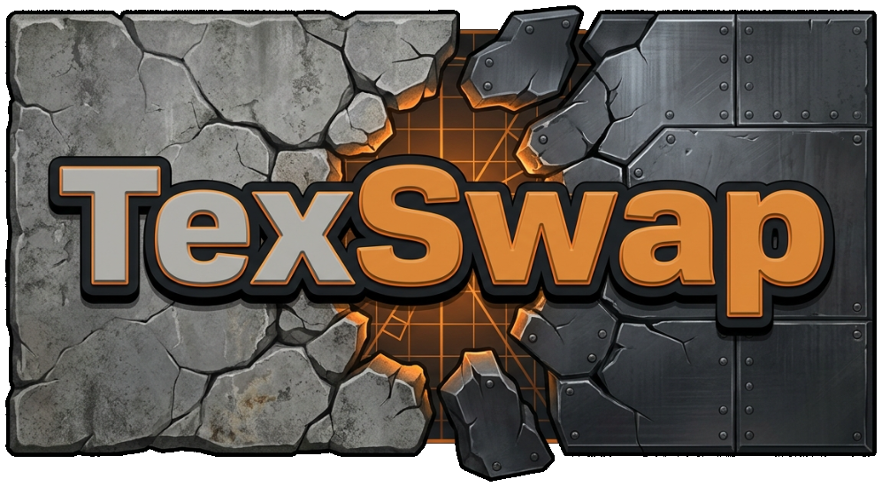

<p align="center">
  
</p>

<h3 align="center"><a href="https://github.com/ScaramangaDK/texswap/releases/latest">⬇️&nbsp;Download TexSwap for Windows</a></h3>
<p align="center"><i>Unzip, run <code>TexSwap.exe</code>, point it at your AQ2/AQtion folder — done.</i></p>

---

Restyle **Action Quake 2 / AQtion** map textures for gameplay and visibility:
browse every texture a map uses, swap it for a stock texture, a flat
visibility color or your own image, change the skybox, AI-upscale the
classic art — and preview it all in a built-in 3D viewer that matches your
in-game light settings. Swaps are per map, saved as presets you can export
and share with friends, and applied automatically every time the map loads.

Nothing in your game install is ever modified: everything lives in one
`texswap/` folder plus a single line in `autoexec.cfg`, and "Reset map"
takes any map back to stock.

## Install

**[Get the latest version](https://github.com/ScaramangaDK/texswap/releases/latest)** — `TexSwap-win64.zip`

1. Unzip anywhere — you get one `TexSwap` folder.
2. Run `TexSwap.exe` from that folder. (Windows SmartScreen may warn once —
   "More info → Run anyway"; normal for unsigned hobby tools.)
3. Point it at your AQ2/AQtion folder (**Browse…**) and click
   **Install game hook** in the orange banner.
4. Pick a map and start swapping. Presets auto-apply on every map load;
   press **F9** in game to re-apply after changing things mid-map.

Requirements: 64-bit Windows and an AQ2/AQtion install with a
q2pro-based client (the standard AQtion engine is exactly that).

## What it can do

- **Per-map texture swaps** — stock textures, generated flat/pattern
  visibility textures, or your own uploaded images; per-swap size control.
- **AI upscale** — redraw a map's classic textures at 2x/3x/4x with
  Real-ESRGAN, straight from the app (see below).
- **Skybox swapping** — every sky set in your install, with thumbnails.
- **3D map viewer** — real BSP geometry with lightmaps, water animation and
  a one-click "use my game light" mode that reads your own cfg files.
- **Presets** — named snapshots per map, master **Swaps ON/OFF**, export to
  `texswap/exports/<map>.aq2swap.json` and import files from friends.
- **Lighting manager** — per-map or global light cvar overrides.
- **Missing-texture fix** — serve a clean placeholder instead of the
  engine's red-dotted notexture on maps with missing files.

## AI upscale (map textures)

**✨ AI upscale…** on a map redraws its textures at 2x/3x/4x with Real-ESRGAN
and stores them as swaps: same art, just crisp. Only the hi-res override is
replaced (what `r_texture_overrides 31` samples); the `.wal` keeps its grid,
so tiling is untouched and low-res mode stays stock. Tick the textures you
want (signs and decals rarely suit it) or take them all; a single texture can
also be upscaled from its card. Choose the source (the original classic art,
or the best hi-res file installed), a detailed or smooth look, and optional
"keep grain" for rusty/dirty walls the AI would paint flat. Results are
cached per texture, so the next map that shares them is instant. Presets
carry the instruction, not the files — a friend importing one runs the
upscale on their own PC. The tool itself (Real-ESRGAN) is fetched on first
use; an NVIDIA/AMD/Intel GPU with Vulkan makes it fast.

## For developers

```
npm install
npm run dev
```

Open http://127.0.0.1:5892 and point it at an AQ2 install root (it
auto-detects `action` layered over `baseaq`; plain Quake 2 installs with
`baseq2` + mods work too).

Build the release artifact:

```
npm run dist
```

Output lands in `dist\TexSwap-win64.zip` (everything under a top-level
`TexSwap\` folder). `npm run build` refreshes the unpacked run folder only;
`npm run app` starts the same app unpackaged in Electron.

See [BRAINSTORM.md](BRAINSTORM.md) for the full history, roadmap and
verified engine facts.

## How it works

The app talks to the engine through q2pro's `link` console command: per-map
cfg files in `<modDir>/texswap/` link each swapped texture name to a
generated file in `texswap/gen/`, and a `cl_beginmapcmd` hook executes the
right cfg on every map load (plus an **F9** re-apply bind). Replacements are
transcoded to every extension the engine might request (`.png`/`.jpg`/`.tga`
in `r_texture_formats` order, plus `.wal` for low-res mode), so swaps work
at any `r_texture_overrides` setting. Shipped game files are never touched.

## Layout

- `core/` — engine-agnostic logic, plain Node ESM:
  - `vfs.js` — engine-accurate virtual FS: game-dir layering (action over baseaq), archive priority, loose files, shipped soft-link fallbacks
  - `bsp.js` — Quake 2 BSP parser (IBSP v38 + QBSP extended): worldspawn, per-texture face counts & areas
  - `decoders.js` — WAL / PCX / TGA decoders (+ PNG/JPG via pngjs & jpeg-js)
  - `thumbs.js` — engine-order texture resolution, downscale, PNG thumbnails
  - `gen.js` — encoders (PNG/JPG/TGA/WAL with palette quantization + mips), flat-texture generator, transcoder
  - `swaps.js` — SwapStore: presets.json, per-map link-cfg generation, hook install
  - `scanner.js` — cached `Install` objects tying it all together
  - `tools.js` — on-demand fetch + runner for Real-ESRGAN (AI upscaler) in `%APPDATA%\AQ2TextureSwapper\tools`
  - `upscale.js` — TextureUpscaler: AI-upscaled map textures as the `upscale` swap type, content-hashed cache in app-data, background job
- `devserver.js` — local HTTP server: serves `ui/` + JSON API
- `electron-main.mjs` — the desktop shell (splash + main window) around the same server
- `ui/` — the app frontend (vanilla HTML/CSS/JS)
- `tools/smoke.js` — CLI smoke test: `node tools/smoke.js <gameDir> [thumbOutDir] [mapName]`

Made by Ralle (ScaramangaDK) — contact in the app's About dialog.
